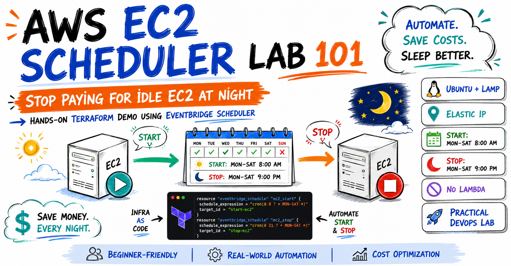

# AWS EC2 Scheduler Lab 101




[](https://www.linkedin.com/in/franconavarro/)
[](https://github.com/francotel)


## Overview

A simple Terraform lab that automatically starts and stops existing Amazon EC2 instances with **Amazon EventBridge Scheduler**.

- Start: Monday–Saturday at **8:00 AM**
- Stop: Monday–Saturday at **9:00 PM**
- Time zone: **America/Lima**
- Direct EC2 API calls: no Lambda or SSM
- Least-privilege IAM permissions

A normal `StopInstances` request allows Ubuntu to perform its standard OS shutdown. The configuration does not use `SkipOsShutdown` or a forced stop.

## Architecture

```text
EventBridge Scheduler
        │
        ▼
IAM execution role
        │
        ▼
EC2 StartInstances / StopInstances
        │
        ▼
Existing EC2 instances
```

## Quick Start

```bash
git clone https://github.com/francotel/ec2-scheduler-lab-101.git
cd ec2-scheduler-lab-101
cp terraform.tfvars.example terraform.tfvars
```

Update `terraform.tfvars`:

```hcl
aws_region = "us-east-1"

instance_ids = [
  "i-0123456789abcdef0",
  "i-0fedcba9876543210"
]

schedule_timezone          = "America/Lima"
start_schedule_expression  = "cron(0 8 ? * MON-SAT *)"
stop_schedule_expression   = "cron(0 21 ? * MON-SAT *)"
schedule_enabled           = false
```

Deploy:

```bash
terraform init
terraform fmt -recursive
terraform validate
terraform plan
terraform apply
```

After reviewing the schedules, enable them:

```hcl
schedule_enabled = true
```

Then run:

```bash
terraform apply
```

## Cleanup

```bash
terraform destroy
```

This removes only the Scheduler and IAM resources created by Terraform. It does not delete the EC2 instances.

## Repository

https://github.com/francotel/ec2-scheduler-lab-101
